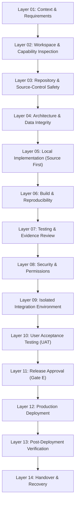

# Delivery Layers Model — AI Workspace Delivery Governor

## 1. Overview & Operating Principle

The **Delivery Layers Model** defines the 14 sequential engineering phases required to govern the delivery of software within the Personal AI Operating System.

> [!IMPORTANT]
> **Adaptive Mode Layer Skipping Rule**:
> The Agent may skip unnecessary non-safety layers in **Quick Mode** (e.g., skipping Layers 08-13 for an isolated local fix). However, it must **never skip a required safety approval gate** (Gate A through Gate E).

---

## 2. The 14 Authoritative Delivery Layers

### Layer 01 — Context and Requirements
- **Input**: User request, project issue, feature specification, existing codebase documentation.
- **Actions**: Reconstruct operational context, clarify ambiguities, confirm acceptance criteria, and determine the appropriate execution mode (Quick, Standard, or Controlled Release). State the selected mode and rationale.
- **Evidence**: Written requirements summary with explicit scope boundaries and identified mode rationale.
- **Output**: Verified requirements specification and selected execution mode.
- **Exit Criteria**: Scope and non-functional goals confirmed without speculative assumptions.
- **Approval Requirements**: None for local exploration; operator confirmation if scope changes significantly.
- **Recovery Method**: Re-interview user or re-read original issue document.

### Layer 02 — Workspace and Capability Inspection
- **Input**: Host environment, active AI coding tool (Antigravity, Claude Code, Cursor, Windsurf), installed SDKs, CLI utilities.
- **Actions**: Inspect available tools, active CLI commands, package managers, and runtime versions. Prohibit unauthorized tool installations.
- **Evidence**: Tool version outputs (e.g., `node -v`, `git --version`, `python --version`).
- **Output**: Environment capability manifest and tool feasibility report.
- **Exit Criteria**: All required build and test tools verified as present in the local workspace.
- **Approval Requirements**: **Gate A** (Tooling & Authentication) required if installing new tools, global packages, or configuring external authentication.
- **Recovery Method**: Revert any local workspace environment variable mutations.

### Layer 03 — Repository and Source-Control Safety
- **Input**: Local git working tree, remote tracking branches, staged changes, unstaged changes, stash entries.
- **Actions**: Inspect working tree cleanliness (`git status`). Detect dirty worktrees and unrelated user edits. Isolate work onto a dedicated feature branch (`feat/<task-name>`). Never work directly on `main` or `master`.
- **Evidence**: Raw `git status` and `git branch` output verifying isolation.
- **Output**: Clean, dedicated feature branch.
- **Exit Criteria**: Working tree is clean or unrelated user edits are strictly quarantined without loss.
- **Approval Requirements**: **Gate C** (Source Control) required before pushing branches, merging, or modifying protected branches.
- **Recovery Method**: Switch back to original branch; abort branch creation; restore working tree state.

### Layer 04 — Architecture and Data Integrity
- **Input**: Existing database schemas, API contracts, domain models, project adapter rules.
- **Actions**: Review proposed architectural alterations for schema breaks, contract regressions, and domain boundary leaks. Keep project-specific parameters in adapters.
- **Evidence**: Schema diffs, interface specifications, type contract definitions.
- **Output**: Architecture Decision Record (ADR) or validated schema migration plan.
- **Exit Criteria**: Backward compatibility verified; zero unhandled data migration risks.
- **Approval Requirements**: **Gate B** (External Resources) required if migrations touch external databases or create cloud entities.
- **Recovery Method**: Discard proposed architectural diff; revert schema draft.

### Layer 05 — Local Implementation
- **Input**: Confirmed requirements, architecture spec, target source files.
- **Actions**: Execute code modifications strictly aligned with requirements. Enforce **Source First**: always edit canonical source files (`src/`), never manually edit generated artifacts (`dist/`, `build/`, minified bundles).
- **Evidence**: `git diff` on authoritative source files showing minimal, surgical changes.
- **Output**: Modified source files matching specification.
- **Exit Criteria**: Code compiles locally and follows established codebase style.
- **Approval Requirements**: None for local source edits within the feature branch.
- **Recovery Method**: `git checkout -- <file>` or `git restore` back to pre-implementation commit.

### Layer 06 — Build and Reproducibility
- **Input**: Modified source tree, build configuration (`package.json`, `tsconfig.json`, `Makefile`, etc.).
- **Actions**: Execute clean build. Enforce **Deterministic Reproducibility**:
  1. Build once (`npm run build`).
  2. Rebuild a second time.
  3. Confirm zero unintended second-build diff.
- **Evidence**: Build execution logs with exit code 0 and hash comparison of build outputs.
- **Output**: Reproducible production bundle in designated output directory.
- **Exit Criteria**: Build passes with zero warnings-as-errors and zero non-deterministic output drift.
- **Approval Requirements**: None for local build verification.
- **Recovery Method**: Clean build artifacts (`rm -rf dist/`) and re-examine source differences.

### Layer 07 — Testing and Evidence Review
- **Input**: Local build output, automated test suites, manual verification scripts.
- **Actions**: Execute tests strictly according to `references/testing-order.md`. Classify every test as **Passed**, **Failed**, **Blocked**, or **Not Run**. Prohibit mock data from being reported as live integration. Prohibit test duration from being quoted as load time.
- **Evidence**: Raw test runner outputs (e.g., Vitest, Jest, PyTest) with individual test case counts.
- **Output**: Verified test execution report with zero fabricated metrics.
- **Exit Criteria**: All unit, contract, and static tests pass cleanly.
- **Approval Requirements**: None for local test execution.
- **Recovery Method**: Fix identified code regressions; re-run failed test suites.

### Layer 08 — Security and Permissions
- **Input**: Modified codebase, package dependency tree, environment configurations.
- **Actions**: Execute secret scan (`\b(ghp_[a-zA-Z0-9_]{20,}|sk-[a-zA-Z0-9]{20,})\b`), audit dependency vulnerabilities (`npm audit`), and verify role-based access control (RBAC) boundaries.
- **Evidence**: Secret scan report with 0 findings; vulnerability audit log.
- **Output**: Security clearance report.
- **Exit Criteria**: Zero hardcoded secrets, no critical unpatched vulnerabilities, and least-privilege compliance.
- **Approval Requirements**: Operator notification if any non-critical dependency warning is accepted.
- **Recovery Method**: Revoke/rotate exposed test credentials; roll back vulnerable dependency additions.

### Layer 09 — Isolated Integration Environment
- **Input**: Build bundle, isolated test environment credentials (sandbox, staging container, mock server).
- **Actions**: Deploy code to a non-production, ephemeral sandbox or isolated test harness. Verify remote API connectivity with isolated test accounts.
- **Evidence**: HTTP request/response logs against sandbox endpoints with zero customer data interaction.
- **Output**: Staging deployment verification report.
- **Exit Criteria**: Application functions accurately against live external staging endpoints.
- **Approval Requirements**: **Gate D** (Test Deployment) required before uploading code to cloud test deployments or utilizing real test credentials.
- **Recovery Method**: Tear down test deployment; terminate sandbox instances.

### Layer 10 — User Acceptance Testing (UAT)
- **Input**: Staging deployment URL, user journeys, functional verification checklist.
- **Actions**: Guide human operator or product owner through end-to-end acceptance scenarios. Verify UI responsiveness, accessibility, and critical business flows.
- **Evidence**: UAT sign-off matrix documenting operator approvals on each verified workflow.
- **Output**: Formally signed-off UAT report.
- **Exit Criteria**: 100% of required user acceptance criteria verified by the human operator.
- **Approval Requirements**: Human stakeholder sign-off.
- **Recovery Method**: Capture user feedback; return to Layer 05 for required adjustments.

### Layer 11 — Release Approval
- **Input**: Comprehensive Stage Report, UAT sign-off, security audit, rollback plan.
- **Actions**: Compile the Release Dossier. Verify that rollback commits or snapshots are documented and tested. Present the dossier to the human operator.
- **Evidence**: Complete Gate E Approval Dossier with explicit risk assessment and rollback command.
- **Output**: Documented operator release approval.
- **Exit Criteria**: Human approval granted explicitly.
- **Approval Requirements**: **Gate E** (Production Release Authorization) strictly required.
- **Recovery Method**: Halt release sequence; remain in staging state.

### Layer 12 — Production Deployment
- **Input**: Approved release bundle, production infrastructure access credentials.
- **Actions**: Execute production deployment script or automated pipeline. Maintain blue-green or zero-downtime cutover where supported.
- **Evidence**: CI/CD deployment execution logs and production endpoint status code 200.
- **Output**: Running production release.
- **Exit Criteria**: Production deployment process completes with exit code 0.
- **Approval Requirements**: Pre-authorized via Gate E.
- **Recovery Method**: Execute Layer 14 rollback procedure immediately if deployment fails.

### Layer 13 — Post-Deployment Verification
- **Input**: Live production URL, synthetic transaction test suite, production log streams.
- **Actions**: Execute non-destructive live production smoke tests. Monitor error rates, latency spikes, and system telemetry for a minimum stabilization window.
- **Evidence**: Live HTTP status 200 responses, clean production error logs, verified telemetry graphs.
- **Output**: Post-deployment verification report.
- **Exit Criteria**: All live smoke tests pass; zero unexpected exceptions in production logs.
- **Approval Requirements**: None for read-only smoke tests.
- **Recovery Method**: If smoke tests fail, immediately initiate automated rollback (Layer 14).

### Layer 14 — Handover and Recovery
- **Input**: Completed deployment evidence, release notes, rollback verification data.
- **Actions**: Document final release state, tag git release commit (`vX.Y.Z`), record active rollback points, update registries, and deliver handover documentation to the human operator.
- **Evidence**: Git release tag, updated CHANGELOG, and verified recovery runbook.
- **Output**: Final handover dossier and archived release record.
- **Exit Criteria**: All documentation committed; operator notified of successful completion.
- **Approval Requirements**: None (post-release administrative step).
- **Recovery Method**: In event of delayed incident, execute documented rollback commit.
